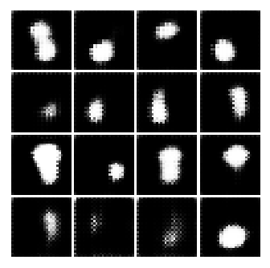
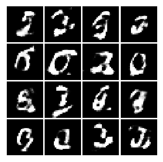
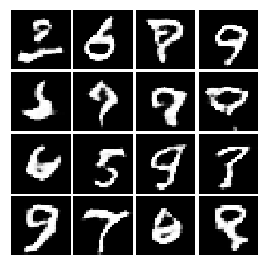
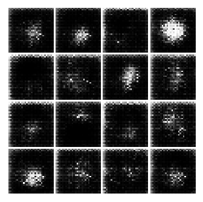
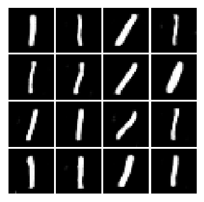
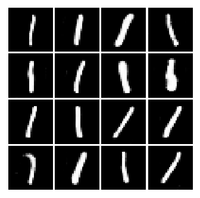

## Training on the MNIST dataset

GANs
- DCGAN (sigmoid activation on the last layer)
- MAD-GAN
- WGAN and GoGAN
- BEGAN

Datasets
- MNIST

Comments
- All of the GANs are trained with a fixed LR=1-e5 for 100k iterations.
- Disclaimer: no hyper-parameter search has been done yet.

## Generated samples

#### DCGAN / After 5k, 50k, 99k iterations

#### MADGAN / After 5k, 50k, 99k iterations

#### WGAN / After 5k, 50k, 99k iterations

#### GoGAN / Stage 1 after 5k, 50k iters and stage 2 after 98k iters

#### BEGAN / After 5k, 50k, 99k iterations

