## Training on MNIST and CelebA datasets

GANs
- DCGAN (sigmoid activation on the last layer)
- MAD-GAN
- WGAN and GoGAN
- BEGAN

Datasets
- MNIST and CelebA

Comments
- All of the GANs are trained with a fixed LR=1-e5 for 100k iterations.
- Disclaimer: no hyper-parameter search has been done yet.

## Samples

### On MNIST dataset

##### DCGAN / After 5k, 50k, 99k iterations

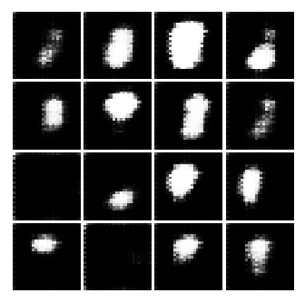 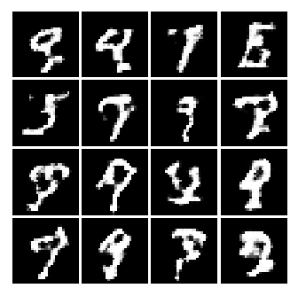 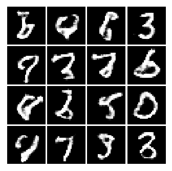

##### MADGAN / After 5k, 50k, 99k iterations

 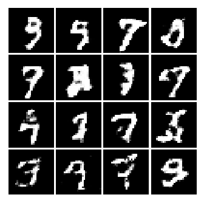 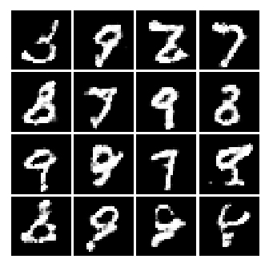

##### WGAN / After 5k, 50k, 99k iterations

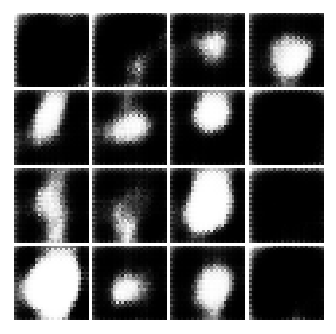  

##### GoGAN / Stage 1 after 5k, 50k iters and stage 2 after 98k iters

 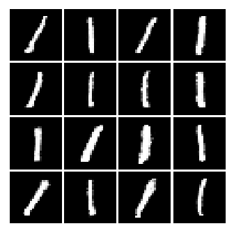 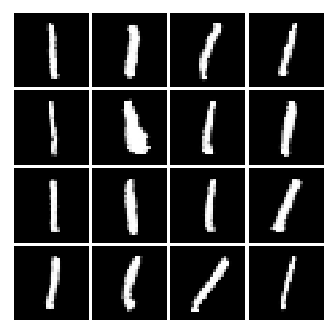

##### BEGAN / After 5k, 50k, 99k iterations

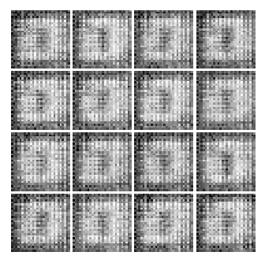  

### On CelebA dataset

##### DCGAN / After 5k, 15k, 20k iterations

- Unfortunately, I've lost latter part of generated images. However, DCGAN wasn't able to generate face-like samples after 20k iterations.

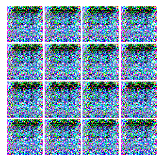 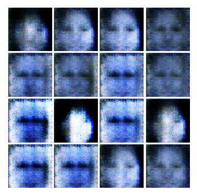 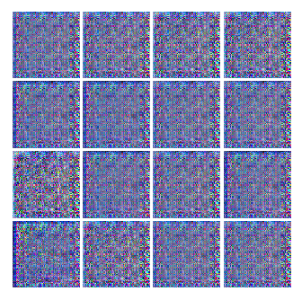

##### MADGAN / After 5k, 50k, 98k iterations

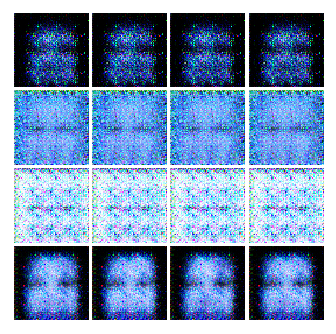 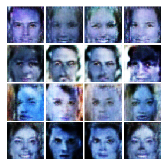 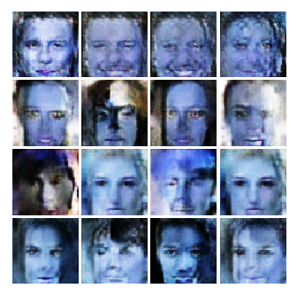

##### WGAN / After 5k, 50k, 99k iterations

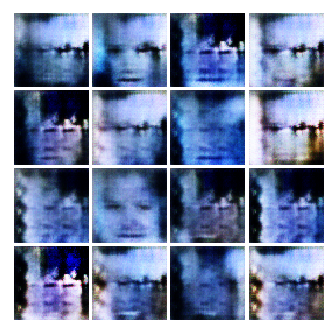 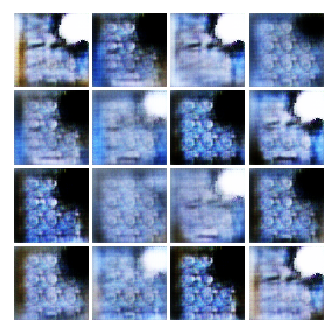 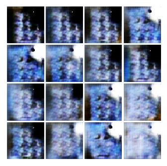

##### GoGAN / Stage 1 after 5k, 50k iters and stage 2 after 99k iters

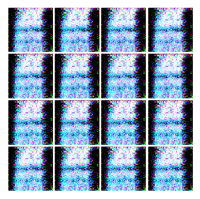 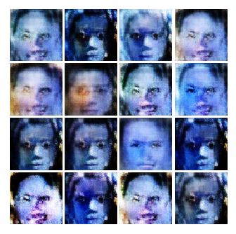 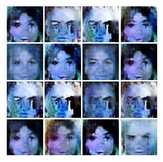

##### BEGAN / After 5k, 50k, 99k iterations

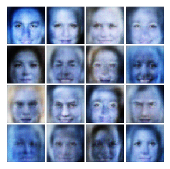 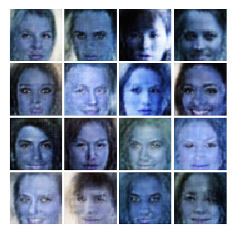 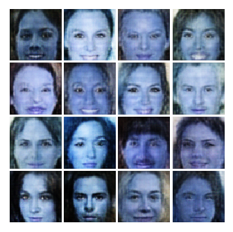
