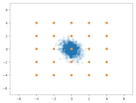
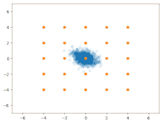
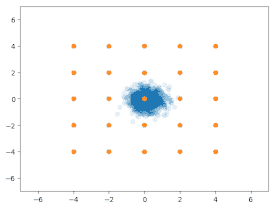
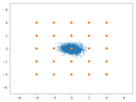
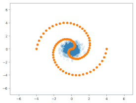
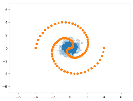
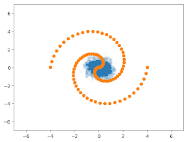
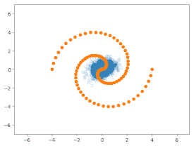
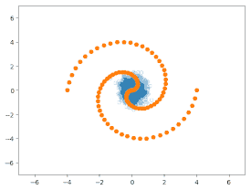

## Experiments on Synthetic Datasets

GAN Candidates
- DCGAN (or just GAN)
- MAD-GAN (an extension of DCGAN)
- WGAN
- GoGAN (an extension of WGAN)
- BEGAN

Datasets
- 2-dim MoG (Mixture of Gaussian) with 5 x 5 modes
- 2-dim spiral

Comments
- Among MAD-GAN generated the best samples among these GANs.
- Basic GAN worked reasonably well in these datasets. (better than WGAN or BEGAN)
- 'Mode collapse' occurs during BEGAN training.
- Disclaimer: no hyper-parameter search has been done yet

## Results

### Mixture of Gaussian (2-dim, 25 modes)

| GAN Name | HQ samples (%) | Modes (%) |
|----|----|----|
| DCGAN | 61.9 | *100* |
| MAD-GAN | *91.9* | *100* |
| WGAN | 58.4 | *100* |
| GoGAN | 48.24 | *100* |
| BEGAN | 62.0 | 24 |

- Sample results with a fixed LR (=1e-4) and 100k iterations.
- About the metrics, please refer to the VEEGAN paper (https://arxiv.org/abs/1705.07761)

##### DCGAN and MADGAN samples

DCGAN(left) and MAD-GAN(right)

 

##### WGAN and GoGAN samples

WGAN(left) and 2-stage GoGAN(right)

 

##### BEGAN samples

BEGAN with LR=1e-4 (left) and LR=1e-6 (right)

#### Spiral (2-dim, 100 modes)

| GAN Name | HQ samples (%) | Modes (%) |
|----|----|----|
| DCGAN | 47.0 | *100* |
| MAD-GAN | *74.2* | *100* |
| WGAN | 48.4 | *100* |
| GoGAN | 65.2 | 20 |
| BEGAN | 41.7 | 88 |

- Sample results with a fixed LR (=1e-4) and 100k iterations.

##### DCGAN and MADGAN samples

DCGAN(left) and MAD-GAN(right)

 

##### WGAN and GoGAN samples

WGAN(left) and 2-stage GoGAN(right)

 

##### BEGAN samples

BEGAN with LR=1e-4 (left) and LR=1e-6 (right)

