## Training on the CelebA dataset

GANs
- DCGAN (sigmoid activation on the last layer)
- MAD-GAN
- WGAN and GoGAN
- BEGAN

Datasets
- CelebA (http://mmlab.ie.cuhk.edu.hk/projects/CelebA.html)

Comments
- All of the GANs are trained with a fixed LR=1-e5 for 100k iterations.
- Disclaimer: no hyper-parameter search has been done yet.

### Generated samples

#### DCGAN

After 4k, 10k, 50k iterations

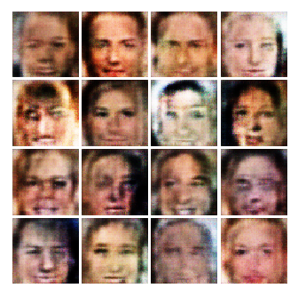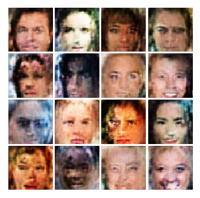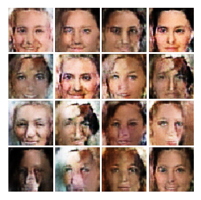

Samples from the last iterations

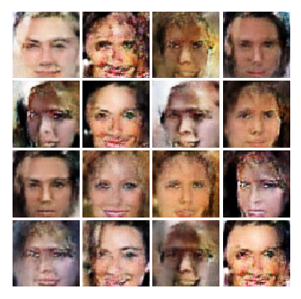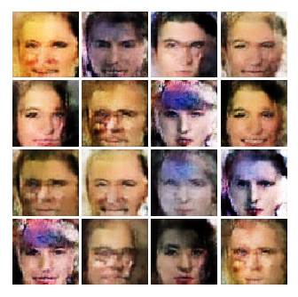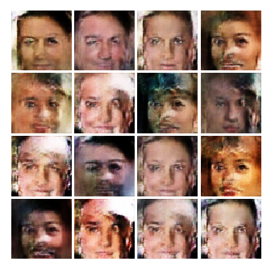

 

#### MADGAN

After 4k, 10k, 50k iterations

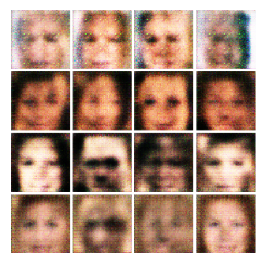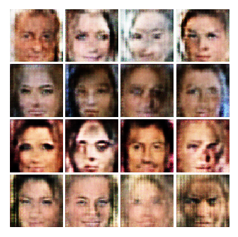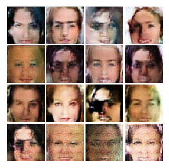

Samples from the last iterations

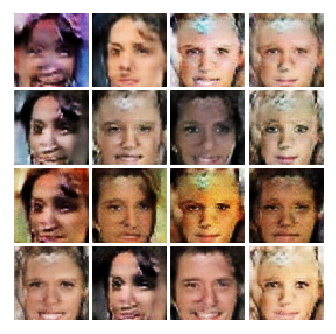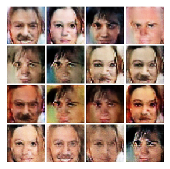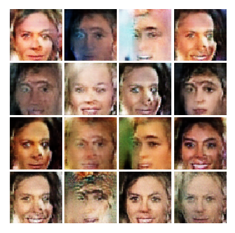

 

#### WGAN

After 4k, 10k, 50k iterations

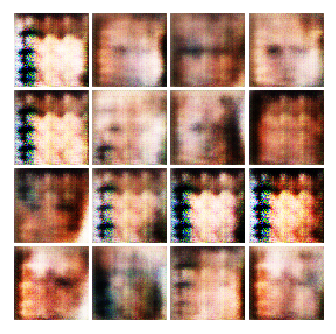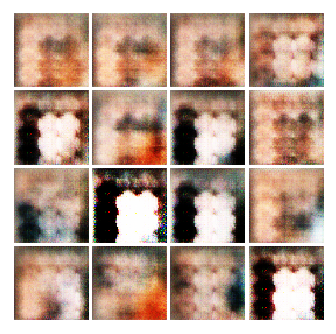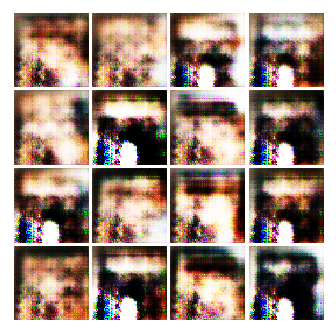

Samples from the last iterations

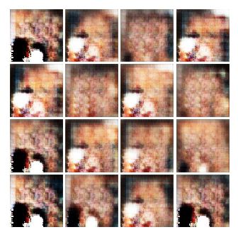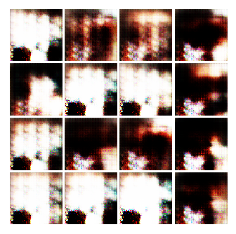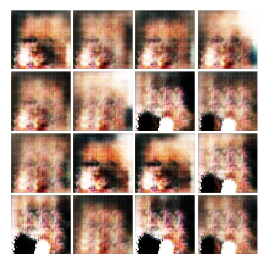

 

#### GoGAN

Stage 1 samples after 4k, 10k, 50k iterations

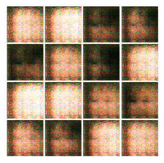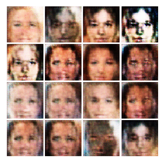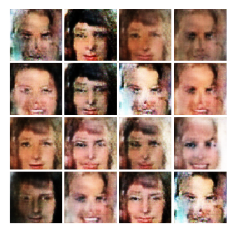

Stage 2 samples from the last iterations

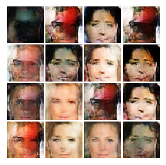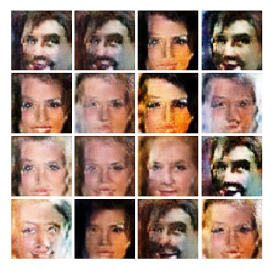

 

#### BEGAN

After 4k, 10k, 50k iterations

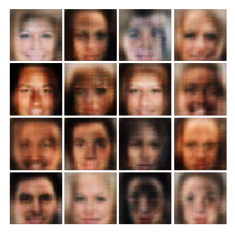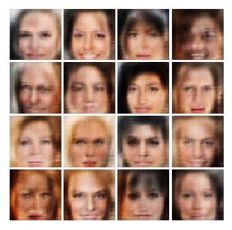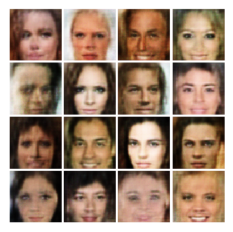

Samples from the last iterations

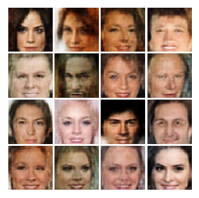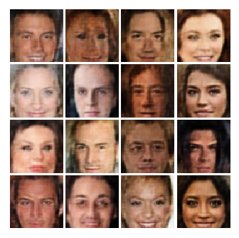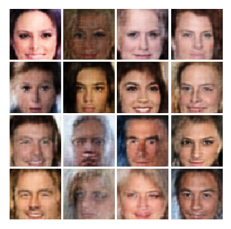
